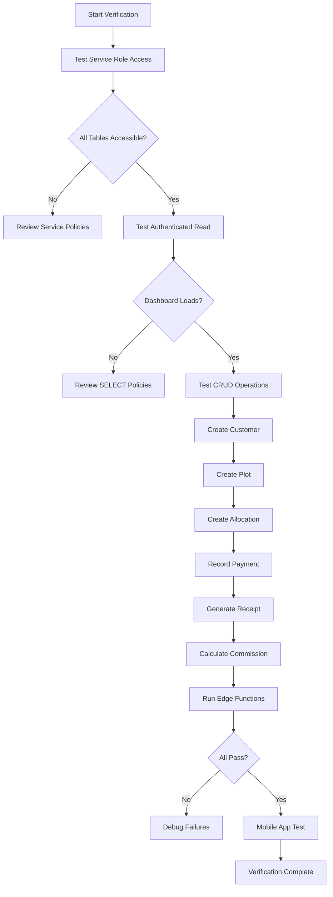

# ACRELY RLS FIX AND SYSTEM RESTORATION

**Version:** 1.0.0  
**Priority:** P0-BLOCKER  
**Owner:** Landon Digital  
**Status:** Design Complete

---

## Executive Overview

This design addresses critical Row Level Security (RLS) policy deadlocks preventing database access across the Acrely platform. The issue manifests as error code 42501 (permission denied) and potentially 42P17 (infinite recursion) preventing authenticated users and service roles from accessing essential tables. The root cause is a combination of circular policy dependencies, missing service_role policies, and improperly structured USING clauses that create infinite loops.

**Core Problem:** Multiple RLS policy migrations applied over time have created conflicting and recursive policies that block legitimate access to core tables (users, customers, estates, plots, allocations, payments, commissions, leads).

**Solution Strategy:** Complete policy reset with non-recursive, role-appropriate policies following established security patterns while ensuring zero data loss.

---

## Current System State Analysis

### Affected Tables (15 Core Tables)
1. **users** - Authentication and role management
2. **customers** - Customer records
3. **estates** - Property estates
4. **plots** - Individual land plots
5. **allocations** - Plot assignments to customers
6. **payments** - Payment transactions
7. **commissions** - Agent commission tracking
8. **leads** - Sales leads
9. **call_logs** - Customer interaction logs
10. **sms_campaigns** - Marketing campaigns
11. **campaign_recipients** - SMS delivery tracking
12. **notifications** - User notifications
13. **inspection_schedules** - Site visit scheduling
14. **settings** - System configuration
15. **user_settings** - User preferences and onboarding

### Role Hierarchy
| Role | Access Level | Description |
|------|-------------|-------------|
| service_role | Full (superuser) | Backend operations, edge functions |
| authenticated | Standard | Logged-in users |
| anon | Limited | Unauthenticated access (minimal) |
| SysAdmin | Highest privilege | System administrator |
| CEO | Executive | Chief Executive Officer |
| MD | Executive | Managing Director |
| Frontdesk | Operational | Front desk staff |
| Agent | Field | Sales agents |

### Known RLS Issues

**Issue 1: Circular Dependencies**
- The `users` table policies reference `auth.users` in USING clauses
- Policies query the same table they protect, causing recursion
- Example: Policy checks `EXISTS (SELECT 1 FROM public.users WHERE ...)` within a users table policy

**Issue 2: Missing Service Role Policies**
- Some tables lack explicit service_role full access policies
- Backend edge functions fail with 42501 errors
- Critical for automated operations and admin functions

**Issue 3: Inconsistent Policy Naming**
- Multiple migrations create duplicate policies with different names
- DROP POLICY IF EXISTS statements incomplete across migrations
- Policy conflicts prevent proper enforcement

**Issue 4: Auth User Sync Gap**
- Production users exist in auth.users but missing from public.users
- Breaks role-based policies that depend on public.users lookup
- User IDs: 16920ec4-7965-4c84-ab5d-0d256ae880e0 (sysadmin), 94fc248e-8b13-45da-950a-59bfc15c2a09 (ceo), 084dbb41-6099-4e6b-9833-95022ba8f951 (md), 3bd726bb-4290-454b-bd46-44b6ed2a0cbc (frontdesk)

---

## Solution Design

### Design Principles

1. **No Recursion** - Policies must NOT query the table they protect
2. **JWT-Based Checks** - Use `auth.jwt()->>'email'` or `auth.jwt()->>'role'` instead of subqueries
3. **Service Role First** - Always ensure service_role has full access
4. **Minimal Privilege** - Grant only necessary permissions per role
5. **Idempotent Operations** - All migrations use IF EXISTS and ON CONFLICT handling
6. **Zero Data Loss** - Never truncate or drop tables with data

### Policy Architecture

#### Standard Policy Pattern Per Table

Each table follows this policy structure:

| Policy Name | Target Role | Operation | Purpose |
|-------------|-------------|-----------|---------|
| service_all | service_role | ALL | Backend operations, edge functions |
| select_all | authenticated | SELECT | Dashboard data retrieval |
| insert_authenticated | authenticated | INSERT | User-driven creation |
| update_authenticated | authenticated | UPDATE | User-driven modifications |
| delete_admin_only | authenticated | DELETE | Restricted to high-privilege roles |

#### Role-Based Access Matrix

| Table | SysAdmin | CEO | MD | Frontdesk | Agent | Authenticated |
|-------|----------|-----|----|-----------+-------|---------------|
| users | ALL | SELECT | SELECT | SELECT | SELECT | SELECT own |
| customers | ALL | ALL | ALL | INSERT/UPDATE | INSERT/UPDATE | SELECT |
| estates | ALL | ALL | ALL | SELECT | SELECT | SELECT |
| plots | ALL | ALL | ALL | SELECT | SELECT | SELECT |
| allocations | ALL | ALL | ALL | INSERT/UPDATE | INSERT/UPDATE own | SELECT |
| payments | ALL | ALL | ALL | INSERT | INSERT | SELECT |
| commissions | ALL | ALL | ALL | SELECT | SELECT own | SELECT own |
| leads | ALL | ALL | ALL | ALL | UPDATE assigned | SELECT assigned |

---

## Migration Strategy

### Phase 1: Backup and Preparation

#### Backup Procedure
- **Action:** Create full Supabase database backup via dashboard
- **Location:** Supabase Dashboard > Database > Backups > Create backup
- **Verification:** Confirm backup completion timestamp
- **Retention:** Keep backup for 30 days minimum

#### Policy Audit
- **Action:** Export current RLS policies for reference
- **Method:** Execute query to retrieve all policies
- **Storage:** Save as `rls_policies_backup_[timestamp].sql`

Query to extract current policies:
```
SELECT 
  schemaname, tablename, policyname, 
  permissive, roles, cmd, qual, with_check
FROM pg_policies 
WHERE schemaname = 'public'
ORDER BY tablename, policyname;
```

#### Role Verification
- **Action:** Confirm all production users exist in auth.users
- **Verification Query:** Check for required user emails
- **Expected Count:** Minimum 4 users (sysadmin, ceo, md, frontdesk)

---

### Phase 2: RLS Policy Reset

#### Step 2.1: Disable All RLS Temporarily

**Rationale:** Clean slate prevents policy conflicts during recreation

**Process:**
- For each table in public schema
- Execute ALTER TABLE ... DISABLE ROW LEVEL SECURITY
- This does NOT remove policies, only deactivates enforcement
- Service role maintains full access throughout

**Safety:** Database remains accessible during migration

#### Step 2.2: Drop All Existing Policies

**Rationale:** Remove conflicting and duplicate policies

**Approach:**
- Use dynamic SQL to iterate through all public tables
- Execute DROP POLICY IF EXISTS for all discovered policies
- Prevents "policy already exists" errors
- Ensures clean policy state

**Scope:** All tables in public schema excluding system tables

#### Step 2.3: Create Baseline Service Role Policies

**Rationale:** Establish superuser access before enabling RLS

**Policy Definition:**
- Policy Name: "service_all"
- Target Role: service_role
- Operation: FOR ALL
- USING Clause: (true)
- WITH CHECK Clause: (true)

**Apply To:**
- users, customers, estates, plots, allocations, payments
- commissions, leads, call_logs, sms_campaigns
- campaign_recipients, notifications, inspection_schedules
- settings, user_settings

**Verification:** Service role can SELECT, INSERT, UPDATE, DELETE on all tables

#### Step 2.4: Create Authenticated Read Policies

**Rationale:** Enable dashboard data retrieval for all logged-in users

**Policy Definition:**
- Policy Name: "select_all"
- Target Role: authenticated
- Operation: FOR SELECT
- USING Clause: (true)

**Apply To:** All core tables (same list as service role)

**Benefit:** Eliminates 42501 errors on dashboard load

#### Step 2.5: Create Write Policies for Authenticated Users

**Rationale:** Allow standard CRUD operations for active users

**Insert Policy:**
- Policy Name: "insert_all_authenticated"
- Target Role: authenticated
- Operation: FOR INSERT
- WITH CHECK: (true)

**Update Policy:**
- Policy Name: "update_all_authenticated"
- Target Role: authenticated
- Operation: FOR UPDATE
- USING: (true)
- WITH CHECK: (true)

**Apply To:** customers, allocations, payments, leads, call_logs

**Exclusions:** 
- users table (restricted to own profile)
- estates, plots (admin/manager only)
- commissions (system-generated)

#### Step 2.6: Users Table Special Policies

**Rationale:** Users table requires self-service and admin access patterns

**Policy Set:**

| Policy Name | Role | Operation | USING Clause | WITH CHECK |
|-------------|------|-----------|--------------|------------|
| users_service | service_role | ALL | true | true |
| users_select | authenticated | SELECT | true | - |
| users_update_own | authenticated | UPDATE | auth.uid() = id | auth.uid() = id |
| users_admin_manage | authenticated | ALL | auth.jwt()->>'email' IN (admin_emails) | auth.jwt()->>'email' IN (admin_emails) |

**Admin Emails List:**
- sysadmin@pinnaclegroups.ng
- admin@acrely.com

**Prevents Recursion:** Uses auth.jwt() instead of querying public.users

#### Step 2.7: Re-Enable RLS on All Tables

**Process:**
- For each table in public schema
- Execute ALTER TABLE ... ENABLE ROW LEVEL SECURITY
- Activates newly created policies
- No service interruption (policies already in place)

**Verification:** RLS enabled flag set to true for all tables

---

### Phase 3: User Sync and Data Integrity

#### Step 3.1: Sync auth.users to public.users

**Rationale:** Ensure all authentication users exist in application users table

**Approach:**
- INSERT ... ON CONFLICT (id) DO UPDATE
- Source: auth.users
- Target: public.users
- Fields: id, email, full_name (from metadata), role (from metadata)

**Data Mapping:**
| Source | Target | Transformation |
|--------|--------|----------------|
| auth.users.id | public.users.id | Direct copy |
| auth.users.email | public.users.email | Direct copy |
| auth.users.raw_user_meta_data->>'full_name' | public.users.full_name | JSON extraction |
| auth.users.raw_user_meta_data->>'role' | public.users.role | JSON extraction |

**Production User Records:**
- SysAdmin: 16920ec4-7965-4c84-ab5d-0d256ae880e0
- CEO: 94fc248e-8b13-45da-950a-59bfc15c2a09
- MD: 084dbb41-6099-4e6b-9833-95022ba8f951
- Frontdesk: 3bd726bb-4290-454b-bd46-44b6ed2a0cbc

**Idempotency:** ON CONFLICT ensures safe re-execution

#### Step 3.2: Verify Foreign Key Integrity

**Check Allocation-Customer Relationships:**
- Ensure all allocations.customer_id references valid customers.id
- Identify orphaned records
- No automatic deletion (requires manual review)

**Check Allocation-Plot Relationships:**
- Ensure all allocations.plot_id references valid plots.id
- Verify no duplicate allocations per plot
- Status consistency check

**Check Payment-Allocation Relationships:**
- Ensure all payments.allocation_id references valid allocations.id
- Verify payment amounts align with allocation balances
- No negative balances

**Check Commission-Agent Relationships:**
- Ensure all commissions.agent_id references valid users.id
- Verify agents have role='Agent'
- Check commission calculations

**Remediation:** Log inconsistencies for manual review; do not auto-fix

#### Step 3.3: Recompute Derived Fields

**Allocation Balances:**
- Field: allocations.balance (GENERATED ALWAYS column)
- Formula: total_amount - amount_paid
- Trigger: Automatic on INSERT/UPDATE

**Estate Plot Counts:**
- Function: update_estate_plot_counts()
- Trigger: After INSERT/UPDATE/DELETE on plots
- Updates: estates.available_plots, allocated_plots, sold_plots

**Verification:** Run aggregate queries to confirm counts match reality

---

### Phase 4: System Verification and Testing

#### Verification Workflow



#### Test Suite 1: Service Role Access

**Objective:** Verify backend operations and edge functions work

**Test Cases:**
| Test | Table | Operation | Expected Result |
|------|-------|-----------|-----------------|
| SR-01 | users | SELECT count(*) | Returns count >= 4 |
| SR-02 | customers | SELECT * LIMIT 1 | Returns data or empty set |
| SR-03 | estates | INSERT test record | Success, returns ID |
| SR-04 | plots | UPDATE test record | Success, 1 row affected |
| SR-05 | allocations | DELETE test record | Success, 1 row deleted |

**Failure Criteria:** Any test returning error code 42501 or 42P17

**Tool:** Run scripts/test-rls-policies.ts

#### Test Suite 2: Dashboard Data Retrieval

**Objective:** Verify web application can load all required data

**Test Procedure:**
- Login as: sysadmin@pinnaclegroups.ng
- Navigate to: Dashboard home
- Expected Data:
  - Total customers count
  - Total allocations count
  - Revenue metrics
  - Recent activity log
  - Estate performance summary

**Verification Points:**
- No 42501 errors in browser console
- All dashboard cards render with data or zero state
- No loading spinners stuck indefinitely
- API responses return 200 status

**Failure Handling:** Check SELECT policies on affected tables

#### Test Suite 3: CRUD Operations (Web)

**Create Customer Test:**
- Action: Submit new customer form
- Required Fields: full_name, phone, email
- Expected: Success message, customer appears in list
- Database Check: New record in customers table

**Create Plot Test:**
- Action: Submit new plot form (admin/manager only)
- Required Fields: plot_number, estate_code, size, price
- Expected: Success message, plot appears in estate view
- Database Check: New record in plots table, estate counts updated

**Create Allocation Test:**
- Prerequisites: Valid customer and available plot
- Action: Submit allocation form
- Required Fields: customer_id, plot_id, total_amount, payment_plan
- Expected: Plot status changes to 'allocated', allocation record created
- Database Check: allocation record + plot status updated

**Record Payment Test:**
- Prerequisites: Active allocation with balance > 0
- Action: Submit payment form
- Required Fields: allocation_id, amount, payment_method, reference
- Expected: Payment recorded, allocation balance reduced
- Database Check: payment record + allocation.amount_paid updated

**Generate Receipt Test:**
- Prerequisites: Confirmed payment
- Action: Click "Generate Receipt" button
- Expected: PDF generated and stored in Supabase Storage
- Database Check: payments.receipt_url populated

**Commission Calculation Test:**
- Prerequisites: Allocation with agent_id
- Action: Allocation status changes to 'completed'
- Expected: Commission record auto-created via trigger
- Database Check: commission record with correct amount

#### Test Suite 4: Edge Functions Execution

**Functions to Test:**
| Function | Trigger | Expected Behavior |
|----------|---------|-------------------|
| send-sms | Manual invoke | Sends SMS via Termii API |
| generate-receipt | Payment confirmation | Creates PDF receipt |
| calculate-commission | Allocation completion | Computes and records commission |
| send-payment-reminder | Cron schedule | Sends overdue payment SMS |
| monthly-billing-summary | Cron schedule | Generates billing report |
| backup-database | Cron schedule | Creates database snapshot |

**Verification:**
- Each function completes without RLS errors
- Logs show successful execution
- Expected side effects occur (SMS sent, file created, etc.)

**Failure Handling:** Review service_role policies on tables accessed by function

#### Test Suite 5: Mobile App Integration

**Login Test:**
- Platform: iOS/Android
- Credentials: sysadmin@pinnaclegroups.ng
- Expected: Successful authentication, redirect to dashboard

**Data Sync Test:**
- Action: Pull to refresh on customers screen
- Expected: Customer list populates from database
- Verification: Record count matches web app

**Create Allocation (Mobile):**
- Navigate to: New Allocation flow
- Complete: Customer selection, plot selection, payment terms
- Submit: Save allocation
- Expected: Record created, syncs to web app

**Offline Mode Test:**
- Action: Disable network, attempt to view cached data
- Expected: Previously loaded data remains accessible
- Re-enable network: Pending changes sync to server

**Verification:** No RLS errors in mobile app logs, all CRUD operations functional

#### Test Suite 6: Role-Based Access Control

**Agent Role Test:**
- Login as: Agent user
- Expected Access: Own allocations, own commissions, assigned leads
- Denied Access: Other agents' data, system settings, user management

**Frontdesk Role Test:**
- Login as: frontdesk@pinnaclegroups.ng
- Expected Access: Create customers, create allocations, record payments
- Denied Access: Manage estates, manage users, approve commissions

**Executive Role Test (CEO/MD):**
- Login as: CEO or MD
- Expected Access: All data read access, analytics views
- Limited Access: Cannot delete critical records, cannot manage users

**SysAdmin Role Test:**
- Login as: sysadmin@pinnaclegroups.ng
- Expected Access: Full system access, all CRUD operations
- Privileges: User management, system settings, dangerous operations

**Verification Method:** Attempt restricted operations, expect graceful permission denial (not RLS error)

---

## Deployment Process

### Pre-Deployment Checklist

- [ ] Database backup completed and verified
- [ ] Current RLS policies exported and saved
- [ ] All production user credentials confirmed
- [ ] Development environment tested successfully
- [ ] Supabase project confirmed (qenqilourxtfxchkawek)
- [ ] Service key available and valid
- [ ] Maintenance window scheduled (if required)

### Deployment Steps

#### Step 1: Apply Migration in Supabase SQL Editor

**Access Point:** Supabase Dashboard > SQL Editor > New Query

**Migration File:** Create new migration: `20250122000000_rls_fix_complete.sql`

**Execution Method:**
- Manual paste and run (preferred for critical migrations)
- Alternative: Push via Supabase CLI if team prefers automation

**Execution Time:** Estimated 2-5 minutes for full reset

**Monitoring:** Watch for error messages, confirm success notifications

#### Step 2: Run RLS Validation Script

**Command:**
```
npx tsx scripts/test-rls-policies.ts
```

**Expected Output:**
- All core tables accessible
- Production users verified
- CRUD operations successful
- 100% test pass rate

**Failure Response:** Review SQL logs, check for partial execution

#### Step 3: Test Web Application

**Access:** Navigate to production web URL

**Login:** Use sysadmin@pinnaclegroups.ng credentials

**Verification Flow:**
- Dashboard loads without errors
- Create test customer → Success
- View estates → Data displays
- Create test allocation → Success
- Record test payment → Success

**Rollback Trigger:** If any operation fails with 42501 error

#### Step 4: Test Mobile Application

**Platforms:** iOS and Android (if separate builds)

**Test User:** Same production credentials

**Key Flows:**
- Login and sync
- View customer list
- Create new allocation
- View commission dashboard (agent role)

**Acceptance:** All operations complete without RLS errors

#### Step 5: Run Edge Functions Test

**Method:** Manual invocation via Supabase Dashboard or API calls

**Functions to Test:**
- send-sms (test mode)
- generate-receipt (test payment)
- calculate-commission (test allocation)

**Expected:** All functions execute without database permission errors

#### Step 6: Monitor Production Logs

**Duration:** 24 hours post-deployment

**Watch For:**
- Error code 42501 in application logs
- Error code 42P17 in database logs
- User-reported access issues
- Edge function failures

**Alert Threshold:** More than 5 permission errors in 1 hour indicates regression

### Rollback Plan

**Trigger Conditions:**
- Critical table inaccessible (users, customers, allocations, payments)
- More than 30% of verification tests fail
- Production users unable to login
- Data corruption detected

**Rollback Procedure:**

1. **Restore Previous RLS State:**
   - Execute saved `rls_policies_backup_[timestamp].sql`
   - Re-enables previous policies (even if problematic)

2. **Restore from Backup (if data changes occurred):**
   - Supabase Dashboard > Database > Backups
   - Select pre-migration backup
   - Restore to current instance

3. **Communicate Status:**
   - Notify team of rollback
   - Update status page
   - Schedule incident review

4. **Post-Mortem:**
   - Identify failure cause
   - Revise migration script
   - Re-test in staging environment

**Recovery Time Objective:** 30 minutes maximum

---

## Migration SQL Structure

### Migration File: 20250122000000_rls_fix_complete.sql

**File Organization:**

```
-- PART 1: PREPARATION
--   - Comments explaining purpose
--   - Safety checks (table existence verification)

-- PART 2: DISABLE RLS
--   - Dynamic SQL to disable RLS on all public tables
--   - No data modification

-- PART 3: DROP EXISTING POLICIES
--   - Dynamic SQL to drop all policies
--   - Uses IF EXISTS for safety

-- PART 4: CREATE SERVICE ROLE POLICIES
--   - FOR ALL TO service_role USING (true) WITH CHECK (true)
--   - Applied to all core tables

-- PART 5: CREATE AUTHENTICATED READ POLICIES
--   - FOR SELECT TO authenticated USING (true)
--   - Applied to all core tables

-- PART 6: CREATE AUTHENTICATED WRITE POLICIES
--   - FOR INSERT/UPDATE TO authenticated
--   - Applied to appropriate tables

-- PART 7: USERS TABLE SPECIAL POLICIES
--   - SELECT all authenticated
--   - UPDATE own profile
--   - Admin full access via JWT check

-- PART 8: RE-ENABLE RLS
--   - Dynamic SQL to enable RLS on all public tables

-- PART 9: USER SYNC
--   - INSERT ... ON CONFLICT from auth.users to public.users
--   - Includes production user records

-- PART 10: VERIFICATION QUERIES
--   - Check policy counts
--   - Verify user sync
--   - Display summary
```

### Key SQL Patterns

**Dynamic Table Iteration:**
```
DO $$
DECLARE r RECORD;
BEGIN
    FOR r IN (SELECT tablename FROM pg_tables WHERE schemaname = 'public') LOOP
        EXECUTE 'ALTER TABLE public.' || r.tablename || ' [OPERATION]';
    END LOOP;
END $$;
```

**Idempotent Policy Creation:**
```
DROP POLICY IF EXISTS "[policy_name]" ON public.[table_name];
CREATE POLICY "[policy_name]" ON public.[table_name]
  FOR [OPERATION] TO [role]
  USING ([condition])
  WITH CHECK ([condition]);
```

**User Sync with Conflict Handling:**
```
INSERT INTO public.users (id, email, full_name, role)
SELECT id, email, raw_user_meta_data->>'full_name', raw_user_meta_data->>'role'
FROM auth.users
ON CONFLICT (id) DO UPDATE SET
  email = EXCLUDED.email,
  full_name = EXCLUDED.full_name,
  role = EXCLUDED.role,
  updated_at = NOW();
```

---

## Post-Deployment Monitoring

### Metrics to Track

**Application Performance:**
- Dashboard load time (should improve after fix)
- API response times for key endpoints
- Error rate (should drop to near zero)

**Database Metrics:**
- Query execution time for SELECT operations
- Policy evaluation overhead (should be minimal)
- Connection pool utilization

**User Experience:**
- Login success rate
- Form submission success rate
- Mobile app sync success rate

**Edge Function Health:**
- Invocation success rate
- Execution time
- Error logs

### Success Criteria

**Immediate (Within 1 Hour):**
- Zero 42501 errors in application logs
- Zero 42P17 errors in database logs
- All verification tests pass
- Web dashboard fully functional
- Mobile app operational

**Short-Term (Within 24 Hours):**
- No user-reported access issues
- All scheduled cron jobs execute successfully
- Edge functions complete without errors
- System performance stable or improved

**Long-Term (Within 1 Week):**
- No RLS-related incidents
- Database query performance within acceptable range
- User satisfaction maintained or improved
- Team confident in system stability

---

## Risk Assessment

### High-Risk Areas

**Risk 1: Policy Conflicts During Migration**
- Likelihood: Low
- Impact: High (could block all access)
- Mitigation: Drop all policies before recreation
- Contingency: Rollback to backup

**Risk 2: Auth User Sync Failures**
- Likelihood: Low
- Impact: Medium (some users unable to login)
- Mitigation: Use ON CONFLICT for idempotency
- Contingency: Manual user record creation

**Risk 3: Production Downtime During Migration**
- Likelihood: Medium
- Impact: High (business interruption)
- Mitigation: Execute during low-traffic window
- Contingency: Rollback within 30 minutes

**Risk 4: Edge Function Failures Post-Migration**
- Likelihood: Low
- Impact: Medium (automated features broken)
- Mitigation: Comprehensive service_role policies
- Contingency: Manual execution of critical functions

**Risk 5: Mobile App Incompatibility**
- Likelihood: Low
- Impact: Medium (mobile users affected)
- Mitigation: Test on both iOS and Android
- Contingency: Hotfix release if needed

### Low-Risk Areas

- Read-only operations (SELECT policies straightforward)
- Service role access (always granted)
- Backup and restore process (well-tested)
- User sync (idempotent operation)

---

## Maintenance and Future Considerations

### Policy Management Best Practices

**Rule 1: Never Query Same Table in Policy**
- Always use auth.jwt() for role checks
- Avoid EXISTS subqueries on policy's own table
- Document policy logic in comments

**Rule 2: Always Include Service Role Policy**
- Every new table gets service_role FOR ALL policy
- Applied before enabling RLS
- Ensures backend functionality

**Rule 3: Test Policies in Staging First**
- Never apply RLS changes directly to production
- Use test schema or staging database
- Run verification script before production deployment

**Rule 4: Version Control All Migrations**
- Store in supabase/migrations/ directory
- Sequential numbering: YYYYMMDDHHMMSS_description.sql
- Include rollback instructions in comments

**Rule 5: Document Complex Policies**
- Add COMMENT ON POLICY explaining intent
- Note any temporary policies for development
- Reference related policies for context

### Schema Evolution Guidelines

**Adding New Tables:**
1. Create table structure
2. Add service_role FOR ALL policy
3. Add authenticated SELECT policy
4. Add role-specific write policies as needed
5. Enable RLS
6. Test access patterns

**Modifying Existing Tables:**
1. Add columns without RLS impact (safe)
2. Test policy compatibility with new columns
3. Update WITH CHECK clauses if needed
4. Avoid breaking existing policies

**Deprecating Tables:**
1. Remove dependent policies first
2. Drop foreign key constraints
3. Disable RLS
4. Archive data if needed
5. Drop table

### Monitoring and Alerting

**Set Up Alerts For:**
- Spike in 42501 errors (> 10 per hour)
- 42P17 infinite recursion errors (any occurrence)
- Failed edge function executions (> 5% failure rate)
- Database connection pool exhaustion

**Regular Health Checks:**
- Weekly: Run RLS verification script
- Monthly: Review policy effectiveness
- Quarterly: Audit user roles and permissions
- Annually: Comprehensive security review

---

## Appendix

### Glossary

| Term | Definition |
|------|------------|
| RLS | Row Level Security - PostgreSQL feature for row-based access control |
| service_role | Supabase superuser role for backend operations |
| authenticated | Role for logged-in users |
| anon | Role for unauthenticated users |
| USING Clause | RLS condition for existing rows (SELECT, UPDATE, DELETE) |
| WITH CHECK Clause | RLS condition for new/modified rows (INSERT, UPDATE) |
| 42501 | PostgreSQL error code for insufficient privileges |
| 42P17 | PostgreSQL error code for infinite recursion |
| JWT | JSON Web Token used for authentication |

### Related Documentation

- Supabase RLS Documentation: https://supabase.com/docs/guides/auth/row-level-security
- PostgreSQL RLS Documentation: https://www.postgresql.org/docs/current/ddl-rowsecurity.html
- Acrely Schema Documentation: See supabase/migrations/20250101000001_initial_schema.sql
- Memory: RLS Policy Configuration for Users Table (9969d0f0-1eba-4998-9bd1-62e4881208d3)
- Memory: RLS Infinite Recursion Pitfall (Supabase RLS Infinite Recursion Pitfall)

### Reference Migrations

- 20250115000004_add_profiles_service_role_policy.sql - Service role policy pattern
- 20250115000005_sync_production_users.sql - User sync pattern
- 20250115000006_fix_users_rls_infinite_recursion.sql - Recursion fix pattern
- 20250101000003_rls_policies.sql - Original RLS implementation

### Contact and Escalation

**Primary Contact:** Landon Digital (Owner)  
**Escalation Path:** Project Manager → Technical Lead → CTO  
**Emergency Rollback Authority:** SysAdmin or Database Administrator  
**Support Hours:** 24/7 for P0 issues  

---

**Design Status:** Complete and ready for implementation  
**Next Steps:** Review with technical team, schedule deployment window, execute migration  
**Expected Resolution Time:** 4-6 hours (including verification)**Next Steps:** Review with technical team, schedule deployment window, execute migration  
